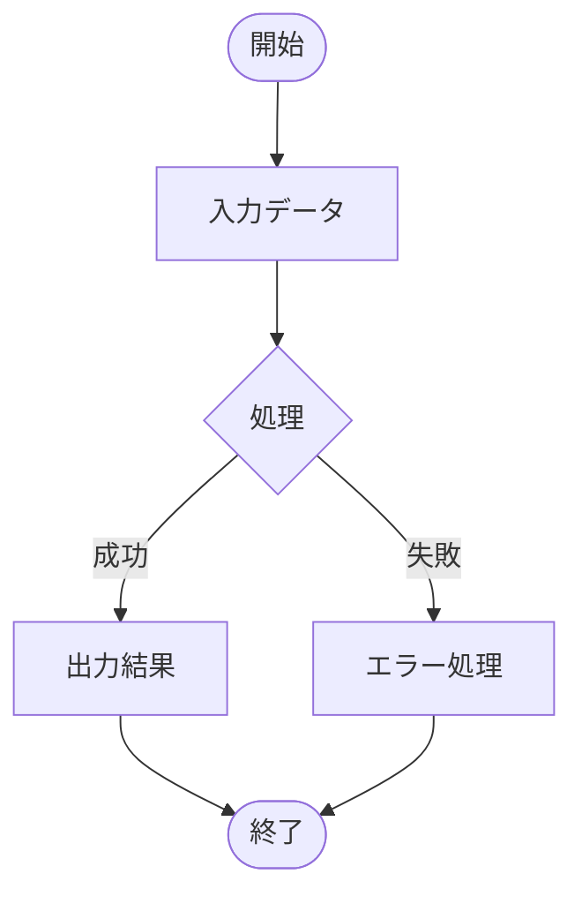
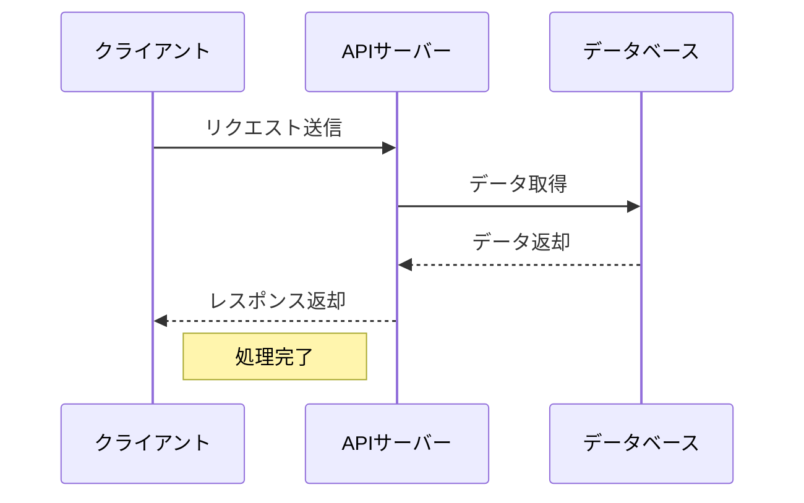
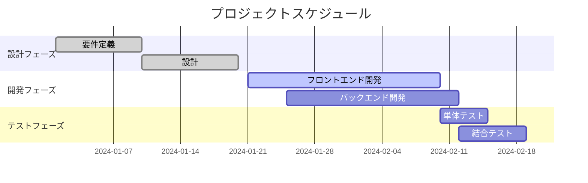
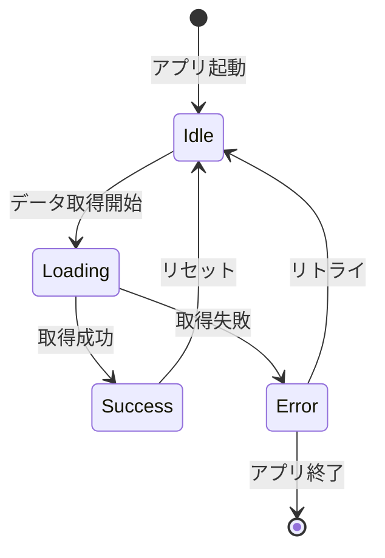
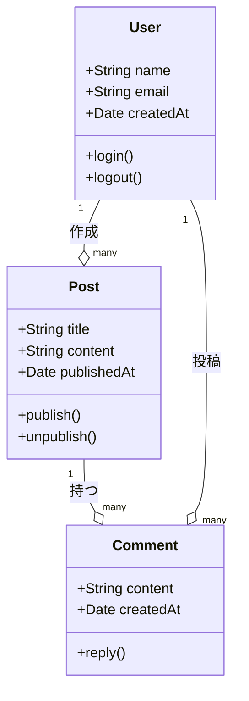

%toc%

<div className="article-content">

## mdx-mermaidとは

**mdx-mermaid**は、MDXファイル内でMermaid図を簡単に表示するためのライブラリです。MDXドキュメントやReactアプリケーションでMermaid図を描けるようになります。

- 公式Doc: https://sjwall.github.io/mdx-mermaid/docs/intro/

### 特徴

- **シンプル**: 簡単な設定でMermaid図を表示
- **MDX対応**: .mdx、.md、.jsx、.tsxファイルで使用可能
- **SVG出力**: 高品質なSVG形式での図の出力
- **React統合**: Reactコンポーネントとしても使用可能

## インストール

パッケージマネージャーを使用してインストールします：

```bash
# npm
npm install mdx-mermaid

# yarn
yarn add mdx-mermaid

# pnpm
pnpm add mdx-mermaid
```

### バージョン対応

- **@mdxjs/mdx v2**: `mdx-mermaid@^2.0.0`を使用
- **@mdxjs/mdx v1**: `mdx-mermaid@^1.3.0`を使用
- **Docusaurus**: `@docusaurus/theme-mermaid@^2.3.1`を使用

## 基本設定

### Next.jsでの設定例

```javascript
// next.config.js
import mdxMermaid from 'mdx-mermaid'

const nextConfig = {
  pageExtensions: ['js', 'jsx', 'mdx', 'ts', 'tsx'],
}

const withMDX = require('@next/mdx')({
  extension: /\.mdx?$/,
  options: {
    remarkPlugins: [
      [mdxMermaid, { mermaid: { theme: 'neutral' }, output: 'svg' }]
    ],
    rehypePlugins: [],
  },
})

module.exports = withMDX(nextConfig)
```

---

❌公式ドキュメントでは以下のように書いてありましたが、ヌギーの環境ではうまく動作しませんでした↓
```jsx
import mdxMermaid from 'mdx-mermaid'
import {Mermaid} from 'mdx-mermaid/lib/Mermaid'

{
  remarkPlugins: [[mdxMermaid.default, {output: 'svg'}]],
  components: {mermaid: Mermaid, Mermaid}
}
```

### MDXコンポーネントの設定

```javascript
// mdx-components.tsx
import type { MDXComponents } from 'mdx/types';

export function useMDXComponents(components: MDXComponents): MDXComponents {
	return {
		...components,
	};
}
```

## 使用方法

### 1. MDXファイル内での使用

MDXファイル内で```mermaid コードブロックを使用：

````markdown

````

### 2. Reactコンポーネントとしての使用

JSX/TSXファイル内で直接使用：

```jsx
import { Mermaid } from 'mdx-mermaid/lib/Mermaid';

function MyComponent() {
  return (
    <Mermaid chart={`
      graph TD;
        A-->B;
        A-->C;
        B-->D;
        C-->D;
    `} />
  );
}
```

## Mermaid図の種類と例

### フローチャート

基本的なフローチャートの例：


````markdown

````

### シーケンス図

API通信の流れを表現：



````markdown

````

### ガントチャート

プロジェクトのスケジュール管理：



````markdown

````

### 状態遷移図

アプリケーションの状態管理：



````markdown

````

### クラス図

オブジェクト指向設計の可視化：



````markdown

````

## 設定オプション
テーマや出力方式を変更することができます。

```jsx
const withMdx = nextMDX({
	extension: /\.mdx?$/,
	options: {
		remarkPlugins: [
			[mdxMermaid, { mermaid: { theme: 'neutral' }, output: 'svg' }]
		],
		rehypePlugins: [],
	},
});
```

- **theme**
  - 種類：
    - 'default' | 'base' | 'dark' | 'forest' | 'neutral' | 'null';
  - ライトモード、ダークモード毎にテーマを個別に設定することもできる
    - 例：`theme: { light: 'neutral', dark: 'forest' }`
- **output**
  - 種類：
    - `'ast' | 'svg';`

## 代替ライブラリ

プロジェクトの要件によっては、以下のライブラリも検討してください：

- **rehype-mermaidjs**: Rehypeプラグインとして使用
- **remark-mermaidjs**: Remarkプラグインとして使用
- **@mermaid-js/mermaid**: 直接Mermaidライブラリを使用

## まとめ

mdx-mermaidは、MDXドキュメントでMermaid図を簡単に表示するための優れたライブラリです。設定も簡単で、様々な図の種類に対応しているため、技術文書やドキュメンテーションに最適です。

視覚的で分かりやすいドキュメントが作成できます。

</div>
