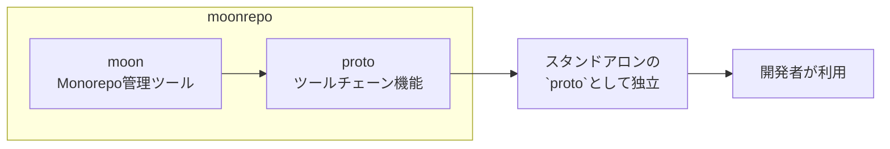

%toc%

<div className="article-content">

## asdfやvoltaを超えるツール「proto」

皆さんの開発環境には、いくつのパッケージマネージャーが入っていますか？

Node.jsのための`nvm`、Pythonのための`pyenv`、Rubyのための`rbenv`... プロジェクトごとに異なる言語やツールを使う現代の開発では、これらの管理が煩雑になりがちです。

「Nodeのバージョン管理は何でしているんだっけ？ nodebrew？ nvm？？」  
「新しいPCに環境を再現するのが大変！」  
...といった経験は誰にでもあるでしょう。

そういった無駄な時間を減らす便利なアプリが`proto`です。  

これ1つさえ入れておけば大体のものに対応でき、一元管理できる優れものです。  
protoがサポートしているツール（言語やパッケージマネージャ）一覧は以下より確認できます↓
- [**Supported tools**](https://moonrepo.dev/docs/proto/tools)

この記事では`proto`の導入方法、基本〜実践的な使い方を具体的に解説します。

## `proto`とは？ - モノレポ管理ツール「moonrepo」から生まれた統一ツール


`proto`は、一言で言えば「**あらゆるプログラミング言語やパッケージマネージャのためのバージョン管理アプリ**」です。

`nvm`や`pyenv`がそれぞれ特定の言語のバージョンを管理するのに対し、`proto`は単一のCLIで、Node.js, Python, Go, Rustなど、さまざまなツールのバージョン管理を統一的に行います。

元々`proto`は、モノレポ管理ツールである[`moon`](https://moonrepo.dev/moon)のツールチェーン機能として開発されました。

- 関連記事：
  - [**モノレポツールのmoonで構築したNestJSのデモアプリ**](/posts/nestjs-with-moon-learn-demo)
  -  [**moonrepoの解説（モノレポ / monorepoのツール、デモをgithubに公開）**](/posts/moonrepo-learn-demo/)

`moon`リポジトリ内で複数のプロジェクトや言語を扱う際に、一貫した開発環境を提供する必要があったのです。

そのツールチェーン部分が非常に強力で汎用性が高かったため、スタンドアロンのツールとして切り出されたのが`proto`です。



そういった背景から、`proto`は単なるバージョン管理に留まらず、大規模で複雑なプロジェクトでの利用を想定した堅牢な作りになっています。

## `proto`のすごい特徴

- **⚡ 超高速:** RustとWASM（WebAssembly）で作られており、非常に高速
- **🌐 マルチ言語対応:** 単一のCLIで、様々な言語のバージョンを管理可能
- **💻 クロスプラットフォーム:** macOS, Linux, Windowsに対応
- **🔌 asdfとも互換性アリ:** [asdf](https://asdf-vm.com/)の800を超えるパッケージマネージャ換性がある
- **🔎 他のバージョン管理システムとも連動:** `.prototools`ファイルや、`.nvmrc`, `.node-version`, `.python-version`のような各言語のエコシステムが持つ設定ファイルを自動で検出し切り替える

## 【基本編】`proto`コマンドを使ってみよう

### 1. インストールとアップグレード

`proto`自体のインストールは非常に簡単です。

```bash
# Linux, macOS, WSL
bash <(curl -fsSL https://moonrepo.dev/install/proto.sh)

# Windows (PowerShell)
irm https://moonrepo.dev/install/proto.ps1 | iex
```

インストールされた確認↓
```bash
proto --version
```

`proto`自身を最新版に保つには、`upgrade`コマンドを使います↓

```bash
proto upgrade
```

---

brewでインストールしたい場合は下記の記事を参考にしてください↓
- [JSのツールチェーン管理ツール「proto」を使ってみる](https://zenn.dev/smartcamp/articles/d185f46f603858#%E3%82%A4%E3%83%B3%E3%82%B9%E3%83%88%E3%83%BC%E3%83%AB)

### 2. ツールの検索とインストール

どんなツールが使えるか検索↓

```bash
# インストール可能なツールの一覧
proto versions

# 特定のツールで利用可能なバージョン一覧 (例: node)
proto versions node
```

- [protoがサポートしているツール（言語やパッケージマネージャ）一覧](https://moonrepo.dev/docs/proto/tools)

使いたいツールとバージョンが見つかったらインストール↓

```bash
# Node.jsの最新LTSバージョンをインストール
proto install node lts

# バージョンを直接指定
proto install go 1.22.1

# asdfのプラグインを使ってElixirをインストール
proto install elixir asdf:1.16.0
```

グルーバルでインストールしたい場合は `--global` をつける
```bash
proto install node lts --pin global

proto install go 1.22.1 --pin global
```

### 3. プロジェクトごとのバージョン設定方法

protoでは、プロジェクトごとに`.prototools`ファイルでバージョンを設定できます

```bash
# 現在のディレクトリで使うNode.jsのバージョンを20に固定
proto pin node 20 --pin
proto pin node 20 --pin local
# -> ./.prototools に `node = "20"` が追記される
```

グルーバルで設定したい場合は `--global` をつける

```bash
proto pin node 20 --to global
```

また、protoは`package.json`, `.nvmrc`, `.node-version`, `.python-version`といった他のバージョン管理の設定ファイルとも連動するので、既存のプロジェクトでもすぐに導入できます！

そして、`status`コマンドで、今いるディレクトリでどのツールとバージョンが有効かを確認できます↓

```bash
proto status

# 以下のように表示される
╭──────────────────────────────────────────────────────────────────────────────────────────────────────────╮
│Tool  Configured  Resolved  Installed                               Config                                │
│──────────────────────────────────────────────────────────────────────────────────────────────────────────│
│node  >=18.17.0   23.11.1   /Users/user/.proto/tools/node/23.11.1  /Users/user/work/project/package.json  │
╰──────────────────────────────────────────────────────────────────────────────────────────────────────────╯
```

上記では、`package.json`で設定されたnodeのバージョンをprotoが自動で読み取っていることがわかります。

### 4. ツールの実行

protoでnodeをインストールした場合、そのまま`node`コマンド か protoの`run`コマンドでツールを実行します。  
※ そのまま`node`コマンドを使用するには、後述する`shims`のパスを通している必要があります。


```bash
node ./my-script.js

# or proto
proto run node -- ./my-script.js
```

### 5. インストールしたツール（言語やパッケージマネージャー）の削除

古くなって使わなくなったバージョンは`clean`コマンドで一括削除できます。

```bash
# 30日以上使われていないツールを削除
proto clean --yes

# 特定のツールを削除
proto uninstall node 18.12.0
```

## 【応用編】`.prototools`を使いこなす

`proto`は、`.prototools`というTOML形式の設定ファイルを活用することでさらに有効に使えます。

このファイルはプロジェクトルート (`./.prototools`)、ユーザーホーム (`~/.prototools`)、proto管理下 (`~/.proto/.prototools`) に置くことができ、それぞれの設定がマージされます。

### バージョン指定

`proto`は多様なバージョン指定が可能です。

```toml
# .prototools

# 完全なセマンティックバージョン
node = "20.11.0"

# カレンダーバージョン
tool-calver = "2024.07.04"

# 範囲指定 (チルダ)
pnpm = "~8.15" # 8.15.0 <= version < 8.16.0

# 範囲指定 (キャレット)
go = "^1.22" # 1.22.0 <= version < 2.0.0

# エイリアス (lts, stable, latestなど)
rust = "stable"

# asdfプラグインを利用
zig = "asdf:0.13.0"
```

`proto alias`コマンドで、自分だけのエイリアスも作成できます。

```bash
proto alias node my-project 20.11.0 --save
# これで .prototools に `node = "my-project"` と書ける
```

### ツールごとの詳細設定

ツールごとに環境変数を設定したり、`asdf`バックエンドを明示的に指定できます。

```toml
# .prototools

# Node.js実行時のみNODE_ENVをproductionにする
[tools.node.env]
NODE_ENV = "production"

# pnpm実行時に.env.pnpmを読み込む
[tools.pnpm.env]
file = ".env.pnpm"

# Elixirの全バージョンでasdfバックエンドを利用する
[tools.elixir]
backend = "asdf"
```

## 【実務での活用編】CI/CDでの活用

`proto`はチーム開発やCI/CDパイプラインでも非常に有能です。

GitHub Actions用の公式アクション`moonrepo/setup-toolchain`が提供されており、CI環境のセットアップを簡略化できます。

```yaml
# .github/workflows/ci.yml
name: CI
on:
  push:
    branches: [ "main" ]
  pull_request:

jobs:
  build:
    runs-on: ubuntu-latest
    steps:
      - uses: actions/checkout@v4

      # このアクションが .prototools を読み込んで...
      - uses: moonrepo/setup-toolchain@v1
        with:
          # ...必要なツールを自動でインストールしてくれる
          auto-install: true

      - run: node --version # -> .prototoolsで指定したバージョンが使われる
      - run: pnpm install
      - run: pnpm build
```

これにより、「ローカルでは動くのにCIでは落ちる」といった環境差異に起因する問題を大幅に減らせます。

## 【深掘り編】protoの3つのツール実行・管理方法の仕組み（ワークフロー）を理解する

`proto`には3つの主要なワークフローがあり、その仕組みが協働した上で成り立っています。  
ワークフローとは、**ツール（例: Node.js など）のバージョン管理や実行方法** の仕組みです。

| ワークフロー            | 特徴                                                                                                          | ユースケース                                   | セットアップ例 (`.zshrc`)                |
| :---------------------- | :------------------------------------------------------------------------------------------------------------ | :--------------------------------------------- | :--------------------------------------- |
| **1. Shims (推奨)**     | `node`のように直接コマンドを叩くと、`proto`が裏でバージョンを解決                                             | ほとんどの状況で推奨される、最も一般的な使い方 | `export PATH="$HOME/.proto/shims:$PATH"` |
| **2. Binary linking**   | `node-20`のようにバージョン番号付きのシンボリックリンクが作られ、Shimより僅かに早い。                         | 複数のバージョンを明示的に使い分けたい場合     | `export PATH="$HOME/.proto/bin:$PATH"`   |
| **3. Shell activation** | `cd`でディレクトリを移動するたびに、`.prototools`を読み込んで環境を再設定し、環境変数も自動で`export`される。 | 自動でバージョンやPATHを検出させたい場合       | `eval "$(proto activate zsh)"`           |

**1〜3のそれぞれのセットアップをしておけば、特に意識せずとも最適にprotoを使えます。**

### ワークフローの全体像

1. Shell activation: ディレクトリ移動時の環境設定
2. Shims: 実際のコマンド実行時のバージョン検出
3. Binary linking: 特定のバージョンで実行

つまり、Shell activationで環境を整えて、Shimsで実際のコマンドを実行するという組み合わせが最も一般的です。

### セットアップ方法

`.zshrc`ファイルに以下を記述すれば、3つの設定全てが完了します！

```bash
export PATH="$HOME/.proto/shims:$HOME/.proto/bin:$PATH" # `shims` -> `bin`の順に有効
eval "$(proto activate zsh)"  # Shell activationも有効
```

**注意:** 3つを併用する場合、`PATH`の順番が重要です。  
`shims` -> `bin`の順に記述してください。

以下、それぞれの詳細です。

### 1. Shims
**「自動切替」方式**
ラッパーファイルを使った方法です。  
`~/.proto/shims/` にある「シムファイル」は、実行コマンドをプロキシして `proto run` 経由（ラップ）で実行します。

- 実行するたびに **そのディレクトリに設定されたバージョンを自動で検出して実行**
- `node`と打つと、protoが「今どのバージョンを使うべきか？」を判断して適切なバージョンを実行してくれる

- 特徴：
  - 自動で判断してくれるから楽
  - 複数バージョンの共存・自動切り替えに強い
  - `.prototools` で定義されたバージョンに従って切り替わる

実行例：
```bash
$ node --version  # 実体は ~/.proto/shims/node 経由で proto run node 実行
```

### 2. Binary linking（バイナリリンク）
**「直接指定」方式**
シンボリックリンクを使った方法です。  
`~/.proto/bin`ディレクトリに、実際のツールへの直接的なシンボリックリンクが作られます。

- `node-18`、`node-20`のように、バージョンを明示的に指定して実行
- 何を使ってるかハッキリしてる

- 特徴：
  - **固定バージョンでの利用に適している**
  - バージョン自動切り替えはできない
  - `PATH` に `~/.proto/bin/` を通す必要あり

実行例：
```bash
$ node-20 --version
```

### 3. Shell activation（シェルアクティベーション）
**「シェル特化」方式**
ディレクトリ変更時に環境を自動セットアップする方法です。  
- `cd` でディレクトリを変更するたびに、そのディレクトリの設定ファイル（`.prototools`）を読み込み、環境を自動設定
- `proto activate <shell>` を `.bashrc` や `.zshrc` に追加して使う

- 特徴：
  - 環境変数の自動エクスポート
  - PATHの自動設定
  - グローバルパッケージも含まれる

設定例： `.zshrc`ファイルに以下を記述
```bash
eval "$(proto activate zsh)"
```

### 比較表

| 機能                     | Shims           | Bins            | Activate               |
| ------------------------ | --------------- | --------------- | ---------------------- |
| バージョン自動切替       | 🟢 あり          | ❌ なし          | ⚠️ あるけど `cd` 時のみ |
| 複数バージョン対応       | 🟢               | 🟢               | 🟢                      |
| 特定バージョン固定       | ⚠️（引数などで） | 🟢（リンク固定） | ⚠️                      |
| 環境変数設定             | ❌               | ❌               | 🟢                      |
| グローバルパッケージ使用 | ❌               | ❌               | 🟢                      |

## 最後に

これまで紹介した機能は`proto`のほんの一部です。ぜひ公式ドキュメントも参照してみてください。

</div>
