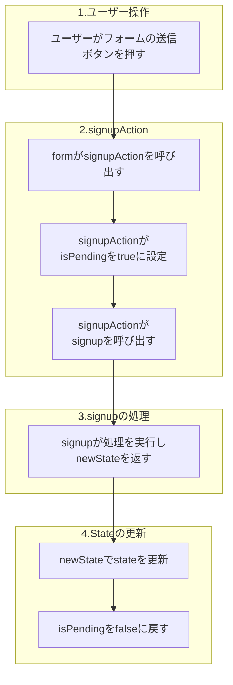
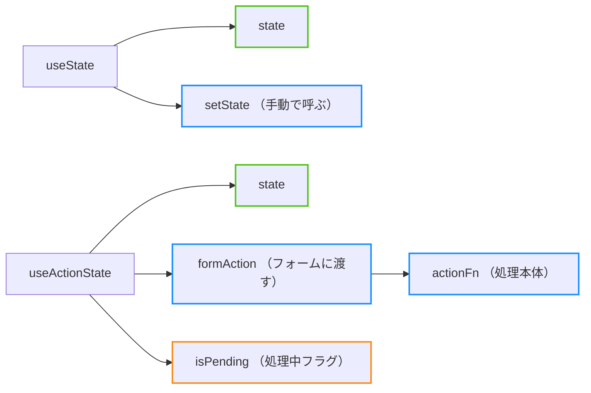

%toc%

<div className="article-content">

## useActionStateは何をするhook？

`useActionState` は **アクション（Action）をトリガーに処理を実行し、その処理結果を state に反映するフック** です。

※アクション（Action）というのはボタンクリック、関数実行などを指していて特にフォーム送信のことが多いです

stateがあり、それを管理・更新するという一部分ではuseStateも同じ機能を持っていますが、useStateだけでは処理が煩雑になる場合があります。

例えば、 **ログイン処理を実行するとき、ログインの成功判定（state）と処理中（isPending）の状態を管理したい！** 、という場面で`useActionState`はとても使い勝手が良いです。

以下のコードの意味がわかるように構文の説明から、応用的な使い方を紹介していきます。

```tsx
const [isSuccess, signupAction, isPending] =
  useActionState(signup, null)

return(
  <div>
    {isSuccess && <p>✅ サインアップ成功</p>}

    <form action={signupAction}>
      <button disabled={isPending}>
        {isPending ? '処理中...' : 'サインアップ'}
      </button>
    </form>
  </div>
)
```

## useActionStateの構文

```tsx
// よくある命名
const [state, formAction, isPending] =
  useActionState(actionFn, initialState, permalink?)
```

formAction が内部で actionFn を呼び出し、返り値をそのまま state に反映してくれます


### 引数

1. **actionFn**
    - `(prevState, formData) => newState` の形の関数
    - **フォーム送信時などに呼び出され、返した値が新しい state になる**
2. **initialState**
    - 最初の state の値
3. **permalink（省略可）**
    - JavaScript 無効時などの場面に備えて設定する関数処理後の遷移先URL
    - 普段は省略するのが一般的
    - 通常の遷移は別の方法を使う

### 返り値

1. **state**
    - 初回は `initialState`
    - `actionFn` の返り値で自動更新される
2. **formAction**
    - `<form action={formAction}>`などに渡す
3. **isPending**
    - 処理中なら `true`

### 引数と返り値の命名

useStateと同じで、引数も返り値も配列なので命名は自由につけられます↓

```tsx
// （例えば...）
const [state, action, isPending] =
  useActionState(handle, initialState, permalink?)

// （サインアップ処理の文脈だと...）
const [isSuccess, signupAction, isPending] =
  useActionState(signup, null)
```

## useActionStateの処理の流れを図解

これはuseActionStateを使ってサインアップ処理処理のコードです↓

```tsx
const [isSuccess, signupAction, isPending] =
  useActionState(signup, null)

return(
  <div>
    {isSuccess && <p>✅ サインアップ成功</p>}

    <form action={signupAction}>
      <button disabled={isPending}>
        {isPending ? '処理中...' : 'サインアップ'}
      </button>
    </form>
  </div>
)
```

このコードを図解すると以下のようになります

- シーケンス図↓

```mermaid
sequenceDiagram
    participant User as ユーザー
    participant Form as <form action={signupAction}>
    participant signupAction as signupAction (ラッパー)
    participant signup as signup (ロジック本体)

    User->>Form: ボタンを押して送信
    Form->>signupAction: action属性で呼び出される
    Note over signupAction: isPending = true
    signupAction->>signup: (prevState, formData) を渡して実行
    signup-->>signupAction: success を返す
    Note over signupAction: isPending = false
```



---

- シーケンス図を大雑把な流れにしたもの↓



## `useState` との違い

### useState

stateを管理するためのもの

```tsx
const [state, setState] = useState(initialState);

<form onSubmit={(e) => {
  e.preventDefault();
  setState(state + 1);
}}>
  <button>+</button>
</form>
```

* **返り値:** `[state, setState]`
* 更新方法: `setState(newValue)` を自分で呼ぶ
* 処理内容は呼び出し時に設定

### useActionState

actionFn（処理）の結果・処理状態を管理するためのもの

```tsx
const [state, formAction, isPending] =
  useActionState(async (prevState, formData) => {
    return prevState + 1;
  }, 0);

<form action={formAction}>
  {state}
  <button disabled={isPending}>+</button>
</form>
```

* **返り値:** `[state, formAction, isPending]`
* 更新方法: `formAction` をフォームに渡すだけでOK（内部で自動更新）
* 処理内容は最初に定義

### 返り値の違いまとめ

| フック             | 戻り値                           | 更新方法                          |
| ------------------ | -------------------------------- | --------------------------------- |
| **useState**       | `[state, setState]`              | `setState(newValue)` を手動で呼ぶ |
| **useActionState** | `[state, formAction, isPending]` | `formAction` をフォームに渡すだけ |



## useStateよりもuseActionStateを使うべき例

以下のような場面では `useActionState` の方が適しています：

1. **フォーム送信処理**
    - フォームデータの送信
    - バリデーション結果の表示
    - 送信成功/失敗の状態管理

2. **非同期処理の状態管理**
    - API呼び出し
    - データベース操作
    - ファイルアップロード

3. **ローディング状態の表示**
    - 処理中のUI表示
    - ボタンの無効化
    - プログレスバーの表示

### ログインフォームの例

仮に以下の要件でログインフォームを実装する例を見てみましょう
- ログインの成功可否でトーストを出す
- ログイン処理中はローディングを出す

#### useStateで実装
```tsx
// 🧐 useStateが2つ必要
const [isLoading, setIsLoading] = useState(false)
const [result, setResult] = useState(null)

// 結果に応じてトースト表示
useEffect(() => {
  if (result === 'success') {
    toast.success('✅ ログイン成功！')
    setResult(null) // リセット
  }
}, [result])

useEffect(() => {
  if (result === 'error') {
    toast.error('❌ ログイン失敗')
    setResult(null) // リセット
  }
}, [result])

// ログイン処理
const handleSubmit = async (e) => {
  e.preventDefault()
  setIsLoading(true)
  setResult(null)

  try {
    const formData = new FormData(e.target)
    const response = await loginUser(formData)
    setResult('success')
  } catch (err) {
    setResult('error')
  } finally {
    setIsLoading(false)
  }
}

return (
  <form onSubmit={handleSubmit}>
    <button disabled={isLoading}>
      {isLoading ? 'ログイン中...' : 'ログイン'}
    </button>
  </form>
)
```

#### useActionState で実装

```tsx
// ログイン処理
const login = async (prevState, formData) => {
  try {
    const result = await loginUser(formData)
    return { status: 'success' }
  } catch (err) {
    return { status: 'error' }
  }
}

// useActionState 1つで状態を管理でき、
// ログイン処理との関係もわかりやすい
const [state, loginAction, isPending] = useActionState(
  login, { status: null }
)

// 成功時のトースト表示
useEffect(() => {
  if (state.status === 'success') {
    toast.success('✅ ログイン成功！')
  }
}, [state.status])

// エラー時のトースト表示
useEffect(() => {
  if (state.status === 'error') {
    toast.error(`❌ ログイン失敗`)
  }
}, [state.status])

return (
  <form action={loginAction}>
    <button disabled={isPending}>
      {isPending ? 'ログイン中...' : 'ログイン'}
    </button>
  </form>
)
```

## useActionStateでuseEffectをなるべく使わない方法

useStateよりもuseActionStateが便利に書けましたが、先ほどのトーストを表示するときに`useEffect`を使ってしまっています。

useEffectを使わない方法を2つ紹介します

### useActionStateのコールバックでのハンドリング

useActionStateのactionFnにまとめて書いてしまうやり方です。  
ただ、少し複雑です。

```tsx
const [state, loginAction, isPending] = useActionState(
  async (prev, formData) => {
    const { status } = await login(prev, formData)

    if (status === 'success') {
      toast.success('✅ ログイン成功！')
    }

    if (status === 'error') {
      toast.error(`❌ ログイン失敗`)
    }
  },
  null
)
```

### withCallbacksを使用

次に`withCallbacks`という関数を自前で用意しておき、それを使用する方法です。

```tsx
const [state, loginAction, isPending] = useActionState(
  withCallbacks(login, {
    onSuccess() {
      toast.success('✅ ログイン成功！')
    },
    onError() {
       toast.error(`❌ ログイン失敗`)
    },
  }),
  { success: false }
)
```

withCallbacks関数↓  
複雑ですが、一度定義してしまえば後は楽です。

```tsx
type Callbacks<T, R = unknown> = {
  onStart?: () => R
  onEnd?: (reference: R) => void
  onSuccess?: (result: T) => void
  onError?: (result: T) => void
}

export const withCallbacks = <
  Args extends unknown[],
  T,
  R = unknown,
>(
  fn: (...args: Args) => Promise<T>,
  callbacks: Callbacks<T, R>,
) => {
  return async (...args: Args) => {
    const promise = fn(...args)

    const reference = callbacks.onStart?.()
    const result = await promise

    if (reference) {
      callbacks.onEnd?.(reference)
    }

    if (result.status === 'success') {
      callbacks.onSuccess?.(result)
    }

    if (result.status === 'error') {
      callbacks.onError?.(result)
    }

    return promise
  }
}
```

</div>
